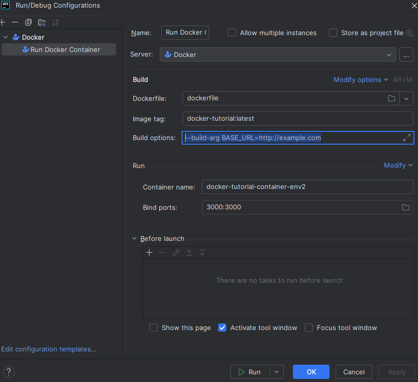

## Configure Docker in WebStorm

1. Install Docker plugin in WebStorm.
2. Go to `Preferences | Languages & Frameworks | Docker` and set the path to the Docker executable.
3. Configure Docker in WebStorm:
    - Go to `File > Settings` (or press `Ctrl + Alt + S`).
    - Navigate to `Build, Execution, Deployment > Docker`.
    - Click the `+` icon to add a new Docker configuration.
    - Select `Docker` and configure the Docker server (usually Docker for Windows on Windows).
    - Click `Apply`.
4. Add a Docker run configuration:
    - Go to `Run > Edit Configurations`.
    - Click the `+` icon and select `Docker`.
    - Configure the new run configuration:
        - **Name**: Run Docker Container.
        - **Image ID or name**: specify the name of the Docker image you want to run, e.g., `my-app:latest`.
        - **Container name**: specify a name for the container, e.g., `my-app-container`.
        - **Ports bindings**: map the container port to the host port, e.g., `3000:3000`.
5. Run the Docker container:
    - Select the `Run Docker Container` configuration from the run configurations dropdown.
    - Click the `Run` button (or press `Shift + F10`) to start the Docker container.

This will run the Docker container using the specified image and configuration.

**NB. To run the Docker daemon, you need to have Docker Desktop installed and running on your machine.**

## How pass environment variables to a Docker container

